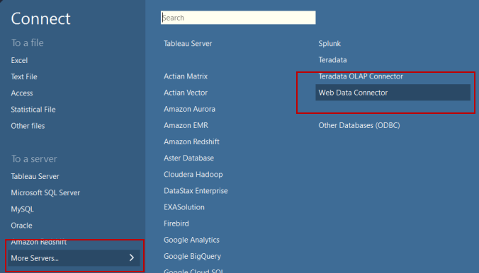
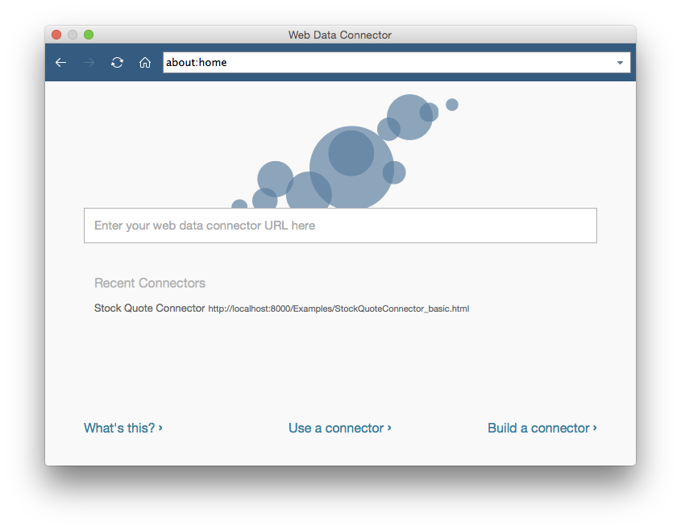
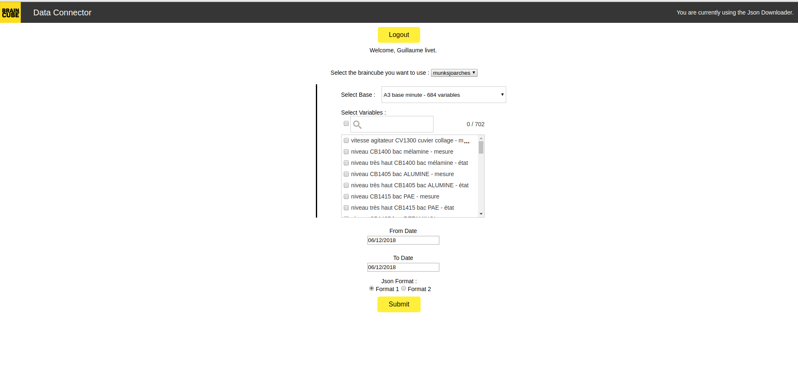
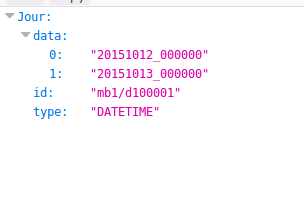
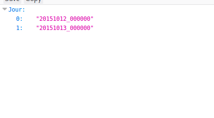

# Connector

> The connector address is **https://mybraincube.com/connectors/tableau**

## Tableau

### The software

<a href="https://www.tableau.com/" target="_blank">Tableau</a> is a software that allows you to manipulate data on a desktop application.
There exists a lot of ways to import data into this application, one of which is the web data connector.

### The connector

You can use our connector by selecting the "Web Data Connector" option in Tableau:

And then, on this page, enter the following address: **https://mybraincube.com/connectors/tableau**

## Download a Json file

### Usage

This webpage allows you to connect to your Braincube account, and retrieve the data you want in a JSON file.

### Format

As you can see above, you can choose two different formats for the JSON file containing your data.

* **Format 1**

    > The JSON file will be structured this way.

    

* **Format 2**

    > The JSON file will be structured this way.
    
    
